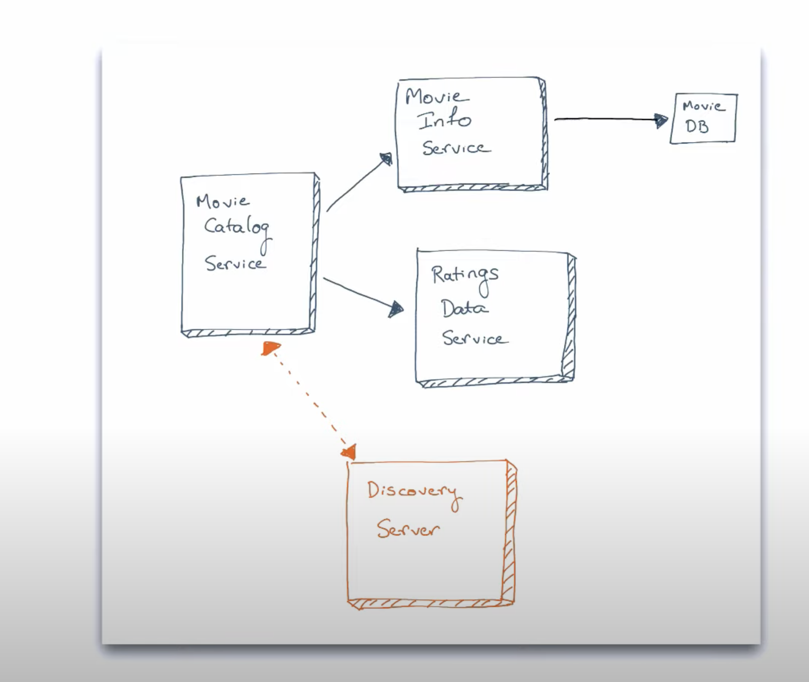
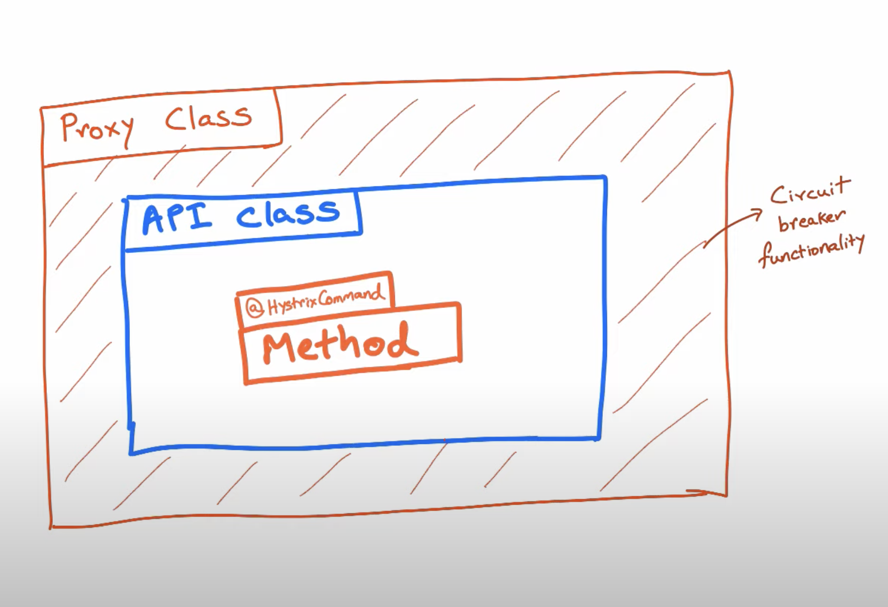

# Springboot Microservices Project
**Spring Boot Microservices Level 1 - Communication and discovery**
***This introduces you to building microservices with Spring Boot and Spring cloud. 
This is Level 1 - start here if you are completely new to building microservices in Spring.***
We've created 3 microservices and have them communicate with each other. 
In the process, how inter-service communication works, and implements service discovery with Eureka to facilitate services finding each other to communicate.

Now we have to build microservices in Spring Boot that are resilient and fault-tolerant. I have implement to use patterns like circuit breaker pattern and the bulkhead pattern. I have also implement use technologies like Hystrix to implement and configure these patterns.

**Spring Boot Microservices Level 2**
**Now to understand the problems with Hystrix proxy and how it affects certain use-cases of dealing with Hystrix and calling methods of the same class annotated with HystrixCommand is that it will work if the Hystrix is directly annotated on the method which is calling the external microservices otherwise it will not work. 
If Method is calling another method with Hystrix then it will not work**
